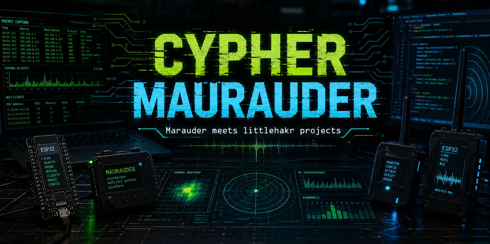

<p align="center">
  
</p>

# Cypher Marauder

**Cypher Marauder is a multi-board ESP32 firmware lab that blends Marauder-style wireless diagnostics with littlehakr hardware projects.** It is built around practical Arduino sketches, board-specific hardware profiles, serial control, OLED/touch interfaces, and reusable modules for WiFi, BLE, RF, RFID, SD logging, HID payload demos, and field diagnostics.

This repo started from ESP32 Marauder inspiration, but it is now shaped as a Cypher/littlehakr project: smaller supported targets, cleaner Arduino-first folders, board-specific firmware, and a shared core that can be carried into new ESP32 builds.

> Use this project only on devices, networks, and cards you own or are explicitly authorized to test.

## What It Can Do

| Area | Features |
| --- | --- |
| WiFi visibility | AP discovery, channel/RSSI/security details, channel heatmaps, passive packet counters, beacon/probe/deauth/EAPOL counting, channel lock, and channel hopping. |
| BLE and Bluetooth | BLE scanning, device listing, Bluetooth serial bridge utilities, and safe Bluetooth HID test flows on supported builds. |
| RF lab work | Starbeam V2 support for NRF24 and CC1101 modules, RF scanning, analyzer views, and capture/replay-oriented module structure. |
| Web and portal tools | Captive portal and web status/dashboard modes on supported boards, with board-local control surfaces. |
| HID payload catalog | Waveshare ESP32-S3 payload folders for iOS demos, recon, productivity/fun demos, GoodUSB style demos, and lab-only security payload experiments. |
| Storage and logs | SD browsing, packet/session logs, RFID dumps, wardriving CSV output, and file preview/delete tools on boards with storage. |
| RFID/NFC lab | Cypherbox MFRC522 tools for card identification, readable block dumps, SD-backed dump files, and controlled restore workflows. |
| Device UI | Serial CLI on every supported sketch, OLED menus on button boards, touch LCD support on Waveshare ESP32-S3, and board-specific status screens. |
| Shared Marauder core | Portable serial commands for AP scans, packet monitoring, counters, channel control, and board integration. |

## Supported Builds

Open the folder for your board, open the matching `.ino`, and upload. These are the supported upload targets in this repo.

| Build | Sketch | Hardware Profile | Best For |
| --- | --- | --- | --- |
| **Project Starbeam V2** | `starbeam_v2/starbeam_v2.ino` | ESP32 with Starbeam OLED/buttons, NRF24, and CC1101 modules | RF lab experiments, WiFi/BLE scans, serial CLI, OLED field controls. |
| **ESP32 DevKitC** | `esp32_devkitc/esp32_devkitc.ino` | Stock ESP32-DevKitC, serial only | Simple Marauder core testing without external hardware. |
| **Waveshare ESP32-S3 1.47** | `waveshare_esp32s3_147/waveshare_esp32s3_147.ino` | Waveshare ESP32-S3 1.47 touch LCD | Touch UI, HID payload catalog, WiFi/BLE tools, SD-oriented workflow. |
| **Cypherbox** | `cypherbox/cypherbox.ino` | OLED/buttons/SD/RFID/GPS/NeoPixel build | Portable field utility with RFID, SD logs, WiFi, BLE, GPS, and serial control. |
| **ESP32 Devboard Custom PCB** | `esp32_devboard_custom/esp32_devboard_custom.ino` | Custom ESP32 devboard with SSD1306, 3 buttons, WS2812 | Compact OLED/button Marauder core build. |

## Repo Layout

```text
cypher-marauder/
├── starbeam_v2/              # RF-heavy Starbeam firmware
├── esp32_devkitc/            # serial-only ESP32 DevKitC baseline
├── waveshare_esp32s3_147/    # Waveshare touch LCD build and HID payload catalog
├── cypherbox/                # OLED/buttons/SD/RFID/GPS Cypherbox firmware
├── esp32_devboard_custom/    # custom OLED/button ESP32 board
└── shared/
    ├── marauder_core/        # portable Marauder-style feature layer
    └── marauder_reference/   # upstream source reference only
```

`shared/marauder_reference/` is kept for future feature porting. Do not upload it directly.

## Arduino CLI Quick Start

Install the ESP32 Arduino core first:

```bash
arduino-cli core update-index
arduino-cli core install esp32:esp32
```

Find your board port:

```bash
arduino-cli board list
```

Compile and upload the build you want:

```bash
# Project Starbeam V2
arduino-cli compile --upload --fqbn esp32:esp32:esp32:PartitionScheme=huge_app --port /dev/cu.usbserial-0001 starbeam_v2

# ESP32 DevKitC
arduino-cli compile --upload --fqbn esp32:esp32:esp32 --port /dev/cu.usbserial-0001 esp32_devkitc

# Waveshare ESP32-S3 1.47
arduino-cli compile --upload --fqbn esp32:esp32:esp32s3:USBMode=hwcdc,PartitionScheme=huge_app --port /dev/cu.usbmodem1101 waveshare_esp32s3_147

# Cypherbox
arduino-cli compile --upload --fqbn esp32:esp32:esp32:PartitionScheme=huge_app --port /dev/cu.usbserial-0001 cypherbox

# ESP32 Devboard Custom PCB
arduino-cli compile --upload --fqbn esp32:esp32:esp32 --port /dev/cu.usbserial-0001 esp32_devboard_custom
```

For the Waveshare ESP32-S3, use a 1200-baud touch if the board does not enter upload mode cleanly:

```bash
stty -f /dev/cu.usbmodem1101 1200
sleep 2
arduino-cli board list
```

Then rerun the upload command with the new port shown by `arduino-cli board list`.

## Arduino IDE Upload

1. Install the ESP32 board package in Arduino IDE.
2. Install the libraries for your board from the table below.
3. Open the `.ino` file inside the folder for your board.
4. Select the matching ESP32 board in **Tools > Board**.
5. Select the required partition scheme when listed below.
6. Select the USB serial port in **Tools > Port**.
7. Click **Upload**.

## Required Libraries

Install with Arduino Library Manager or `arduino-cli lib install`.

| Build | Libraries |
| --- | --- |
| Starbeam V2 | `Adafruit GFX Library`, `Adafruit SSD1306`, `U8g2_for_Adafruit_GFX`, `RF24`, `SmartRC-CC1101-Driver-Lib`; the second CC1101 driver files are bundled in `starbeam_v2/src/`. |
| ESP32 DevKitC | None beyond the ESP32 board package. |
| Waveshare ESP32-S3 1.47 | `Adafruit GFX Library`, `Adafruit ST7735 and ST7789 Library`, `Adafruit SSD1306`, `NimBLE-Arduino`. |
| Cypherbox | `Adafruit GFX Library`, `Adafruit SSD1306`, `U8g2_for_Adafruit_GFX`, `TinyGPSPlus`, `RTClib`, `MFRC522`, `Adafruit NeoPixel`. |
| ESP32 Devboard Custom PCB | `Adafruit GFX Library`, `Adafruit SSD1306`, `FastLED`. |

## Serial Monitor

All supported sketches use `115200` baud.

```bash
arduino-cli monitor --port /dev/cu.usbserial-0001 --baudrate 115200
```

## Shared Marauder Core Commands

The shared core exposes a common serial command set across the supported boards. The custom ESP32 devboard also exposes the core through an OLED **Marauder Core** menu item.

```text
marauder help
marauder status
marauder wifi
marauder list
marauder monitor
marauder monitor beacon
marauder monitor probe
marauder monitor deauth
marauder monitor eapol
marauder channel 6
marauder hop on
marauder hop off
marauder stop
marauder reset
```

## Project Rules

- The five build folders in the supported table are the active board sketches.
- Each supported sketch is self-contained enough to compile from its folder.
- The root README is the project overview; board folders can have deeper wiring and command notes.
- Upstream Marauder source in `shared/marauder_reference/` is reference material only.
- Keep new features board-aware: add shared logic to `shared/marauder_core/` when it is portable, and keep hardware-specific code inside the board folder.

## Status

Cypher Marauder is actively evolving as a hardware lab repo. Expect fast iteration around board profiles, safer defaults, cleaner UI flows, payload organization, and reusable ESP32 modules for future littlehakr devices.
