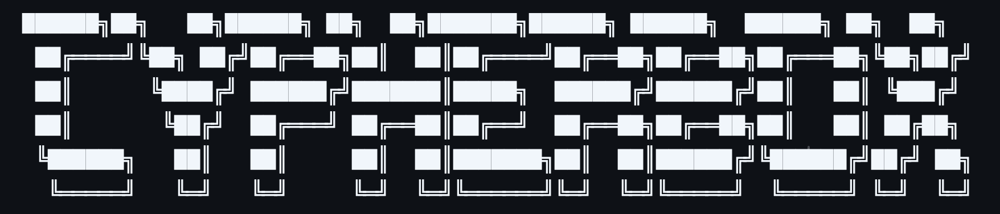
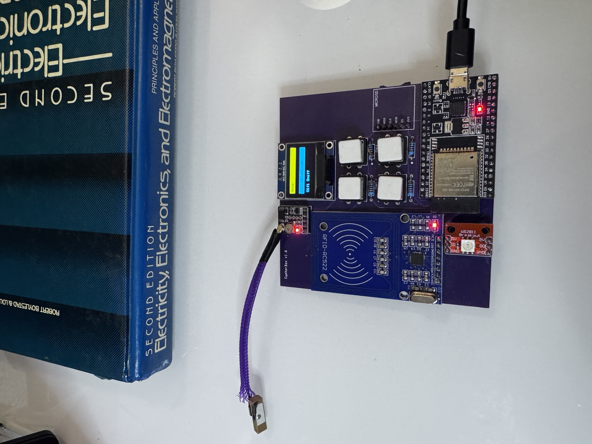
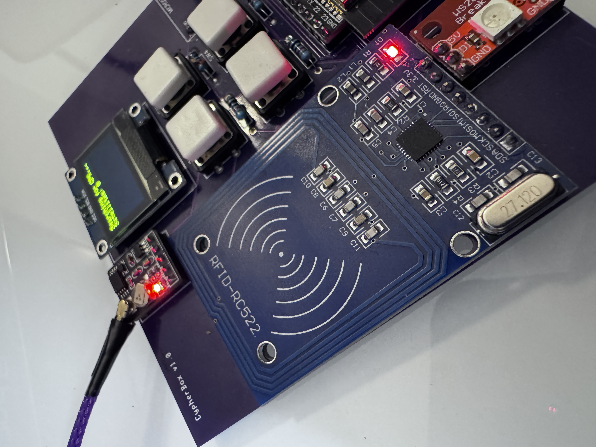
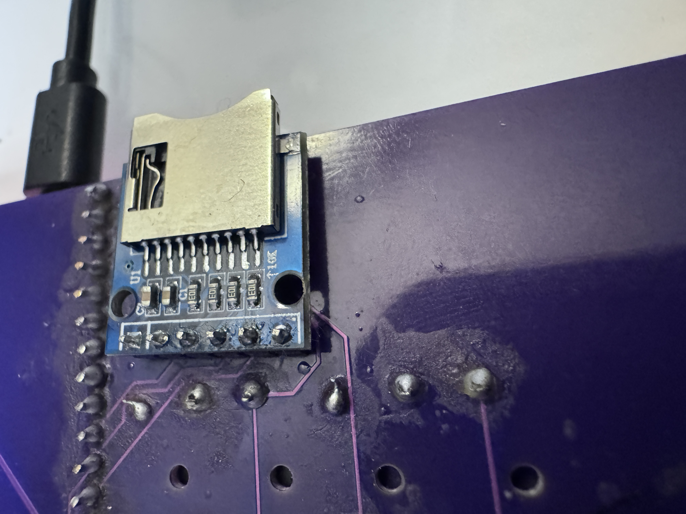
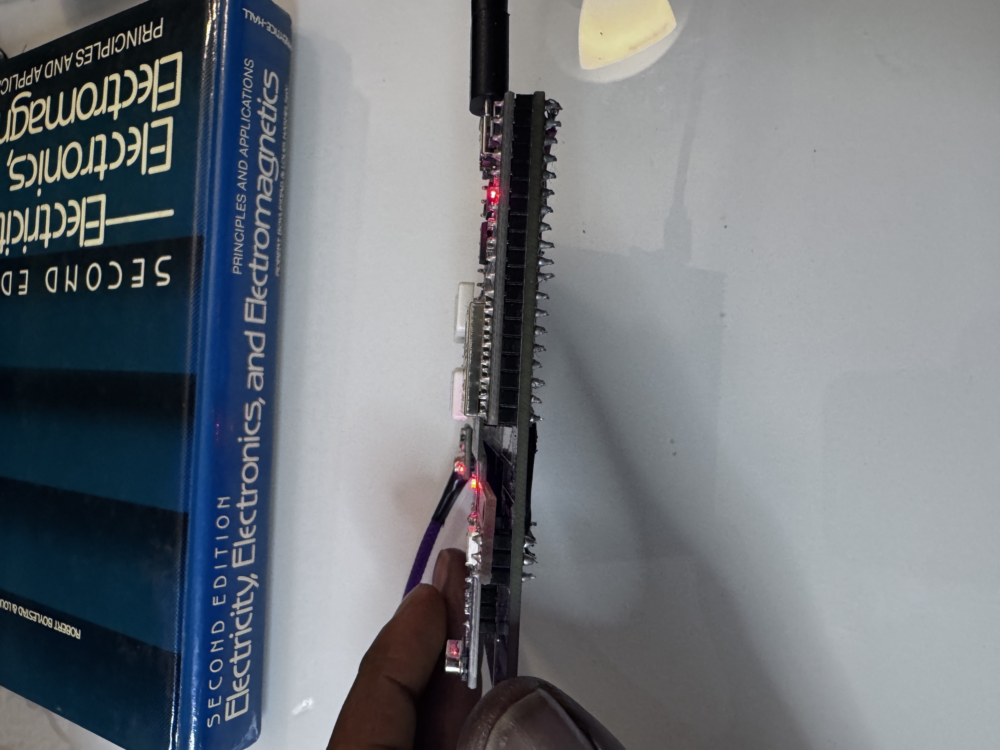
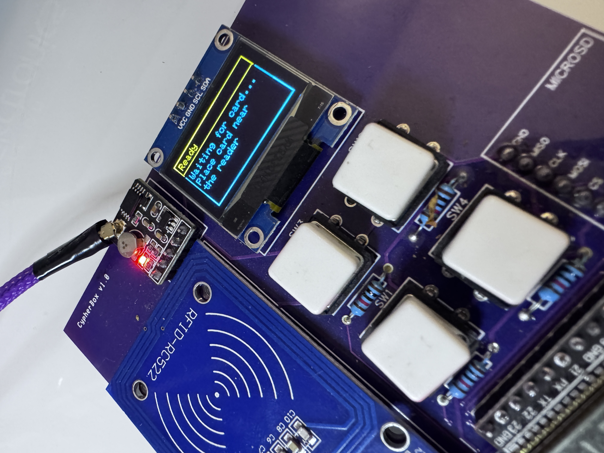
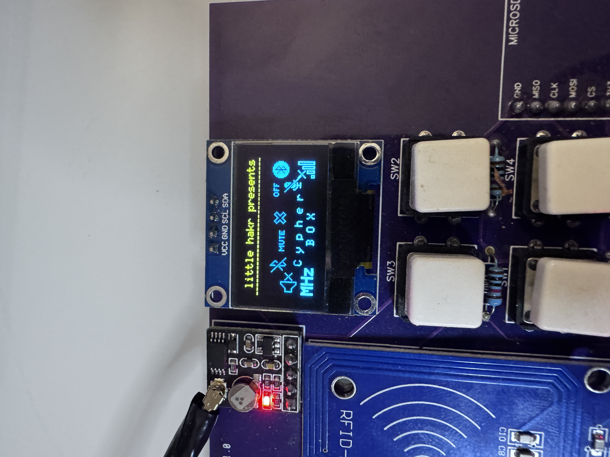
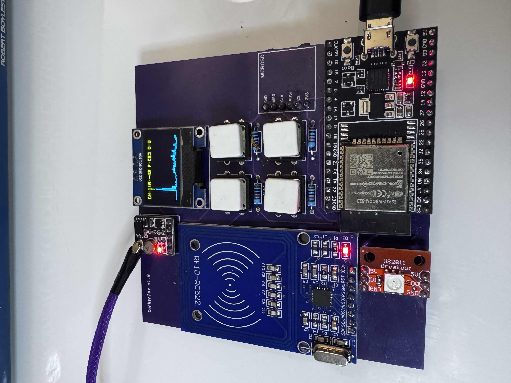

# cypherbox
## The multifunctional ESP32 cybersecurity/networking tool.



- This project leverages the ESP32-WROOM-32D microcontroller, featuring a robust setup with an SSD1306 128x64 OLED screen, an SD card module, three input buttons, a MRFC522 RFID reader, and a GPS to create a sandbox for testing cybersecurity and networking operations.
- The schematics and PCB files are available for you to create yourself!
- Get $5 for new users when you make it at PCBWay! https://pcbway.com/g/87Pi52 

**TIP**:
- **Home**: Pin 2 (**WHEN UPLOADING CODE YOU MUST HOLD DOWN THIS BUTTON TO ENTER BOOT MODE**)

## Current Features
- **RFID/NFC Lab Tools**: Identify MFRC522 tags, show UID/type/SAK/ATQA, read MIFARE blocks with the default lab key, dump readable blocks to SD, and restore saved dumps to blank/writable test cards while skipping block 0 and trailer blocks.
- **Packet Monitor**: Passive WiFi packet/channel monitor with RSSI, management/data/control counts, channel switching, and optional PCAP recording to SD.
- **WiFi Tools**: Network scanner, channel heatmap, AP create/stop, WiFi join by serial command, captive portal dashboard, and web status views.
- **BLE/Bluetooth Tools**: BLE scanner, Bluetooth Serial command bridge, and a safe BT HID test mode that sends harmless text only.
- **GPS Wardriver**: Collect GPS/satellite data and WiFi networks into a CSV log on SD.
- **SD Card Operations**: List, preview, and confirmed-delete files; RFID dumps and packet captures save to SD.
- **User Interface**: Three-button OLED menu, serial CLI, NeoPixel controls, and stop-all cleanup.

Attack/deauth/devil-twin style modes are intentionally disabled in this V2 build. The project is focused on non-attack scanning, lab RFID work, diagnostics, and local device utilities.

## Build

```bash
arduino-cli compile --fqbn esp32:esp32:esp32:PartitionScheme=huge_app
```

The modular V2 firmware needs the `huge_app` partition scheme.

## Serial Commands

```bash
help
menu
status
stop
wifi_scan
wifi_heatmap
wifi_join <ssid> <password>
packet_mon
wifi_sniff
packet_record on|off
channel <1-13>
rfid
read_blocks
rfid_dump
rfid_list
rfid_write <dump>
sd_list
sd_read <file>
sd_delete <file> confirm
ble_scan
bt_create
bt_serial
bt_hid
web_on
web_off
web_status
wardriver
files
read_files
stop_all
```

## Parts List

| Component                     | Description                                      |
|-------------------------------|--------------------------------------------------|
| **ESP32-WROOM-32E**       | Microcontroller with Wi-Fi and Bluetooth support |
| **SSD1306 128x64 OLED Display** | .96-inch screen for displaying information      |
| **SD Card Module**            | Module for reading and writing SD cards         |
| **MFRC522 RFID Module**     | Module for RFID reading and writing         |
| **WS2812 Neopixel LED**     | Status LED                                        |
| **Push Buttons**              | 3 buttons for user interaction                   |
| **Resistors**                 | 10kΩ resistors (optional)         |
| **Breadboard**                | For prototyping connections                       |
| **Jumper Wires**              | For making connections between components        |
| **3V Power Supply**              | Suitable power source for the ESP32             |

## Parts used to make this device:
- **ESP32-WROOM-32D**:
https://amzn.to/4j3QTLo

- **MFRC522 RFID Module**:
https://amzn.to/4gP9FEX

-**GPS Module**:
https://amzn.to/4j7HTF3

- **SSD1306 128x64 Screen**:
https://amzn.to/3TqELJe

- **SD Card Module**:
https://amzn.to/3zsvJot

- **Tactile Buttons**:
https://amzn.to/4gripRD
- **Neopixel WS2812 LED**:


## Wiring

### MFRC522 RFID Module
- **RST**: Pin 25
- **SS**: Pin 27
- **MOSI**: Pin 23
- **MISO**: Pin 19
- **SCK**: Pin 18
- **VCC**: 3V
- **GND**: GND

### SD Card Module
- **CS**: Pin 5
- **MOSI**: Pin 23
- **MISO**: Pin 19
- **SCK**: Pin 18
- **VCC**: 3V
- **GND**: GND

### GPS Module
- **TX**: Pin 17
- **RX**: Pin 16

### Neopixel WS2812 LED
- **DI**: Pin 26
- **VCC**: 5V
- **GND**: GND

### Buttons

- **Up**: Pin 34
- **Down**: Pin 35
- **Select**: Pin 15
- **Home**: Pin 2 (**WHEN UPLOADING CODE YOU MUST HOLD DOWN THIS BUTTON TO ENTER BOOT MODE**)

## Development and Updates

The code is under active development, with regular updates planned to enhance functionality and stability. Keep an eye on this repository for the latest improvements and feature additions.









